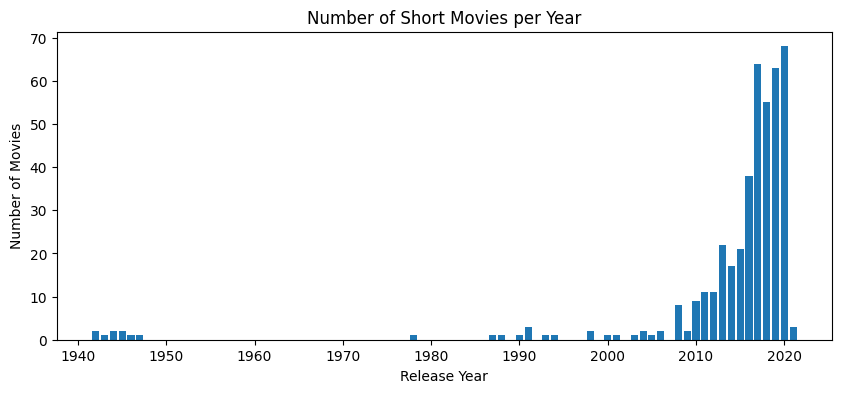
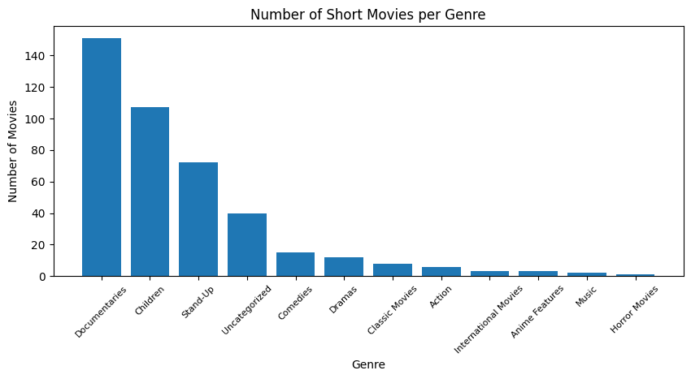
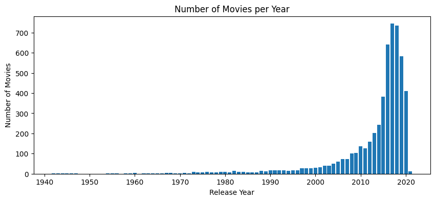
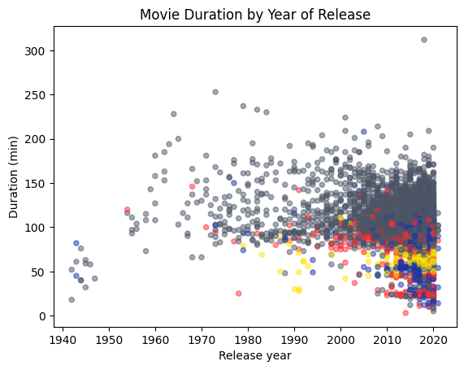

# Investigating Netflix movies

**Netflix**! What started in 1997 as a DVD rental service has since exploded into one of the largest entertainment and media companies.

Given the large number of movies and series available on the platform, it is a perfect opportunity to flex your exploratory data analysis skills and dive into the entertainment industry. Our friend has also been brushing up on their Python skills and has taken a first crack at a CSV file containing Netflix data. They believe that the average duration of movies has been declining. Using your friends initial research, you'll delve into the Netflix data to see if you can determine whether movie lengths are actually getting shorter and explain some of the contributing factors, if any.

You have been supplied with the dataset `netflix_data.csv` , along with the following table detailing the column names and descriptions. This data does contain null values and some outliers, but handling these is out of scope for the project. Feel free to experiment after submitting!

## The data
### **netflix_data.csv**
| Column | Description |
|--------|-------------|
| `show_id` | The ID of the show |
| `type` | Type of show |
| `title` | Title of the show |
| `director` | Director of the show |
| `cast` | Cast of the show |
| `country` | Country of origin |
| `date_added` | Date added to Netflix |
| `release_year` | Year of Netflix release |
| `duration` | Duration of the show in minutes |
| `description` | Description of the show |
| `genre` | Show genre |


```python
# Importing pandas and matplotlib
import pandas as pd
import matplotlib.pyplot as plt

# Start coding!
```

## Netflix movies

First, we will import the csv file as a *pandas dataframe* and then we will filter out TV Shows to only keep the movies.


```python
netflix_df = pd.read_csv('netflix_data.csv')
print(netflix_df)
```

         show_id     type                                    title  \
    0         s1  TV Show                                       3%   
    1         s2    Movie                                     7:19   
    2         s3    Movie                                    23:59   
    3         s4    Movie                                        9   
    4         s5    Movie                                       21   
    ...      ...      ...                                      ...   
    7782   s7783    Movie                                     Zozo   
    7783   s7784    Movie                                   Zubaan   
    7784   s7785    Movie                        Zulu Man in Japan   
    7785   s7786  TV Show                    Zumbo's Just Desserts   
    7786   s7787    Movie  ZZ TOP: THAT LITTLE OL' BAND FROM TEXAS   
    
                   director                                               cast  \
    0                   NaN  João Miguel, Bianca Comparato, Michel Gomes, R...   
    1     Jorge Michel Grau  Demián Bichir, Héctor Bonilla, Oscar Serrano, ...   
    2          Gilbert Chan  Tedd Chan, Stella Chung, Henley Hii, Lawrence ...   
    3           Shane Acker  Elijah Wood, John C. Reilly, Jennifer Connelly...   
    4        Robert Luketic  Jim Sturgess, Kevin Spacey, Kate Bosworth, Aar...   
    ...                 ...                                                ...   
    7782        Josef Fares  Imad Creidi, Antoinette Turk, Elias Gergi, Car...   
    7783        Mozez Singh  Vicky Kaushal, Sarah-Jane Dias, Raaghav Chanan...   
    7784                NaN                                            Nasty C   
    7785                NaN                         Adriano Zumbo, Rachel Khoo   
    7786           Sam Dunn                                                NaN   
    
                 country          date_added  release_year  duration  \
    0             Brazil     August 14, 2020          2020         4   
    1             Mexico   December 23, 2016          2016        93   
    2          Singapore   December 20, 2018          2011        78   
    3      United States   November 16, 2017          2009        80   
    4      United States     January 1, 2020          2008       123   
    ...              ...                 ...           ...       ...   
    7782          Sweden    October 19, 2020          2005        99   
    7783           India       March 2, 2019          2015       111   
    7784             NaN  September 25, 2020          2019        44   
    7785       Australia    October 31, 2020          2019         1   
    7786  United Kingdom       March 1, 2020          2019        90   
    
                                                description             genre  
    0     In a future where the elite inhabit an island ...  International TV  
    1     After a devastating earthquake hits Mexico Cit...            Dramas  
    2     When an army recruit is found dead, his fellow...     Horror Movies  
    3     In a postapocalyptic world, rag-doll robots hi...            Action  
    4     A brilliant group of students become card-coun...            Dramas  
    ...                                                 ...               ...  
    7782  When Lebanon's Civil War deprives Zozo of his ...            Dramas  
    7783  A scrappy but poor boy worms his way into a ty...            Dramas  
    7784  In this documentary, South African rapper Nast...     Documentaries  
    7785  Dessert wizard Adriano Zumbo looks for the nex...  International TV  
    7786  This documentary delves into the mystique behi...     Documentaries  
    
    [7787 rows x 11 columns]


```python
# Filtering out TV Shows
netflix_subset = netflix_df.loc[netflix_df['type'] != 'TV Show']
print(netflix_subset)
```

         show_id   type                                    title  \
    1         s2  Movie                                     7:19   
    2         s3  Movie                                    23:59   
    3         s4  Movie                                        9   
    4         s5  Movie                                       21   
    6         s7  Movie                                      122   
    ...      ...    ...                                      ...   
    7781   s7782  Movie                                     Zoom   
    7782   s7783  Movie                                     Zozo   
    7783   s7784  Movie                                   Zubaan   
    7784   s7785  Movie                        Zulu Man in Japan   
    7786   s7787  Movie  ZZ TOP: THAT LITTLE OL' BAND FROM TEXAS   
    
                   director                                               cast  \
    1     Jorge Michel Grau  Demián Bichir, Héctor Bonilla, Oscar Serrano, ...   
    2          Gilbert Chan  Tedd Chan, Stella Chung, Henley Hii, Lawrence ...   
    3           Shane Acker  Elijah Wood, John C. Reilly, Jennifer Connelly...   
    4        Robert Luketic  Jim Sturgess, Kevin Spacey, Kate Bosworth, Aar...   
    6       Yasir Al Yasiri  Amina Khalil, Ahmed Dawood, Tarek Lotfy, Ahmed...   
    ...                 ...                                                ...   
    7781       Peter Hewitt  Tim Allen, Courteney Cox, Chevy Chase, Kate Ma...   
    7782        Josef Fares  Imad Creidi, Antoinette Turk, Elias Gergi, Car...   
    7783        Mozez Singh  Vicky Kaushal, Sarah-Jane Dias, Raaghav Chanan...   
    7784                NaN                                            Nasty C   
    7786           Sam Dunn                                                NaN   
    
                 country          date_added  release_year  duration  \
    1             Mexico   December 23, 2016          2016        93   
    2          Singapore   December 20, 2018          2011        78   
    3      United States   November 16, 2017          2009        80   
    4      United States     January 1, 2020          2008       123   
    6              Egypt        June 1, 2020          2019        95   
    ...              ...                 ...           ...       ...   
    7781   United States    January 11, 2020          2006        88   
    7782          Sweden    October 19, 2020          2005        99   
    7783           India       March 2, 2019          2015       111   
    7784             NaN  September 25, 2020          2019        44   
    7786  United Kingdom       March 1, 2020          2019        90   
    
                                                description          genre  
    1     After a devastating earthquake hits Mexico Cit...         Dramas  
    2     When an army recruit is found dead, his fellow...  Horror Movies  
    3     In a postapocalyptic world, rag-doll robots hi...         Action  
    4     A brilliant group of students become card-coun...         Dramas  
    6     After an awful accident, a couple admitted to ...  Horror Movies  
    ...                                                 ...            ...  
    7781  Dragged from civilian life, a former superhero...       Children  
    7782  When Lebanon's Civil War deprives Zozo of his ...         Dramas  
    7783  A scrappy but poor boy worms his way into a ty...         Dramas  
    7784  In this documentary, South African rapper Nast...  Documentaries  
    7786  This documentary delves into the mystique behi...  Documentaries  
    
    [5377 rows x 11 columns]


```python
# Keeping only the title, country, genre, release year and duration
netflix_movies = netflix_subset[['title', 'country', 'genre', 'release_year', 'duration']]
print(netflix_movies)
```

                                            title         country          genre  \
    1                                        7:19          Mexico         Dramas   
    2                                       23:59       Singapore  Horror Movies   
    3                                           9   United States         Action   
    4                                          21   United States         Dramas   
    6                                         122           Egypt  Horror Movies   
    ...                                       ...             ...            ...   
    7781                                     Zoom   United States       Children   
    7782                                     Zozo          Sweden         Dramas   
    7783                                   Zubaan           India         Dramas   
    7784                        Zulu Man in Japan             NaN  Documentaries   
    7786  ZZ TOP: THAT LITTLE OL' BAND FROM TEXAS  United Kingdom  Documentaries   
    
          release_year  duration  
    1             2016        93  
    2             2011        78  
    3             2009        80  
    4             2008       123  
    6             2019        95  
    ...            ...       ...  
    7781          2006        88  
    7782          2005        99  
    7783          2015       111  
    7784          2019        44  
    7786          2019        90  
    
    [5377 rows x 5 columns]


## Short movies


```python
# Filtering out movies longer than 59 minutes
short_movies = netflix_movies.loc[netflix_movies['duration'] < 60]
print(short_movies)
```

                                                      title        country  \
    35                                            #Rucker50  United States   
    55                  100 Things to do Before High School  United States   
    67    13TH: A Conversation with Oprah Winfrey & Ava ...            NaN   
    101                                   3 Seconds Divorce         Canada   
    146                                      A 3 Minute Hug         Mexico   
    ...                                                 ...            ...   
    7679                    WWII: Report from the Aleutians  United States   
    7692  Ya no estoy aquí: Una conversación entre Guill...            NaN   
    7718                     Yoo Byung Jae: Discomfort Zone    South Korea   
    7771                                               Zion  United States   
    7784                                  Zulu Man in Japan            NaN   
    
                  genre  release_year  duration  
    35    Documentaries          2016        56  
    55    Uncategorized          2014        44  
    67    Uncategorized          2017        37  
    101   Documentaries          2018        53  
    146   Documentaries          2019        28  
    ...             ...           ...       ...  
    7679  Documentaries          1943        45  
    7692  Documentaries          2020        15  
    7718       Stand-Up          2018        54  
    7771  Documentaries          2018        12  
    7784  Documentaries          2019        44  
    
    [420 rows x 5 columns]


From the above data, we can observe that short movies are mostly concentrated in 3 genres : Documentaries, Children and Stand-Up. Ignoring the Uncategorized category, other genres all have less than 20 short movies.


```python
# Counting the number of short movies per genre
year_counts = short_movies['release_year'].value_counts()

# Creating the bar plot using plt.bar()
plt.figure(figsize=(10, 4))
plt.bar(year_counts.index, year_counts.values)
plt.title('Number of Short Movies per Year')
plt.xlabel('Release Year')
plt.ylabel('Number of Movies')
plt.show()
```


    

    


```python
# Counting the number of short movies per genre
genre_counts = short_movies['genre'].value_counts()

# Creating the bar plot using plt.bar()
plt.figure(figsize=(10, 4))
plt.bar(genre_counts.index, genre_counts.values)
plt.title('Number of Short Movies per Genre')
plt.xlabel('Genre')
plt.ylabel('Number of Movies')
plt.xticks(rotation=45, size=8)
plt.show()
```


    

    


The above plot shows that there a lot more short_movies nowadays (starting from around 2008) than thre used to be. We can observe what seems to be an exponential growth in short movies being released from 2010 to 2020. This may say two things : movies are getting shorter, or more documentaries, stand-ups and children movies are being released than before. Our data set here is only limited to short movies. We cannot say that movies are getting shorter as we can assume that there are just more movies being released on Netflix every year, and that these movies are recent. To conclude on whether or not movies are getting shorter, we must compare the count of short movies proportionally to the count of all movies.


```python
# Counting the number of short movies per genre
year_counts = netflix_movies['release_year'].value_counts()

# Creating the bar plot using plt.bar()
plt.figure(figsize=(10, 4))
plt.bar(year_counts.index, year_counts.values)
plt.title('Number of Movies per Year')
plt.xlabel('Release Year')
plt.ylabel('Number of Movies')
plt.show()
```


    

    


```python

```

This interactive plot confirms that Netflix mostly has recent movies. It correlates with the previous short movies plot.

## Release years per genre

### Adding colors to the genres


```python
import matplotlib
colors = []
zorders = []

# Let's iterate through netflix_movies and assign a color to the genres

for genre in list(netflix_movies['genre']):
    if genre == 'Documentaries':
        colors.append('#1833AC')
        zorders.append(2)
    elif genre == 'Children':
        colors.append('#FF2D33')
        zorders.append(2)
    elif genre == 'Stand-Up':
        colors.append('#FFE502')
        zorders.append(2)
    else:
        colors.append('#4C5566')
        zorders.append(1)
```

### Let's plot the results


```python

fig, ax = plt.subplots()

# Create a scatter plot for movie duration by release year
# Using the colors list to color the points
ax.scatter(netflix_movies['release_year'], netflix_movies['duration'], c=colors, alpha=0.5, s=20)

# Setting the labels and title
ax.set_xlabel('Release year')
ax.set_ylabel('Duration (min)')
ax.set_title('Movie Duration by Year of Release')

plt.show()
```


    

    


```python
answer="no"
```

As we can see above, there are more documentaries, children movies and stand-up shows from 2010 to 2020 on Netflix than ones released before 2010, which can explain why previous plots could hint at movies getting shorter. We can also clearly see that movies as a whole are not getting shorter, there are just more movies than there used to be, at least according to Netflix' catalogue.
